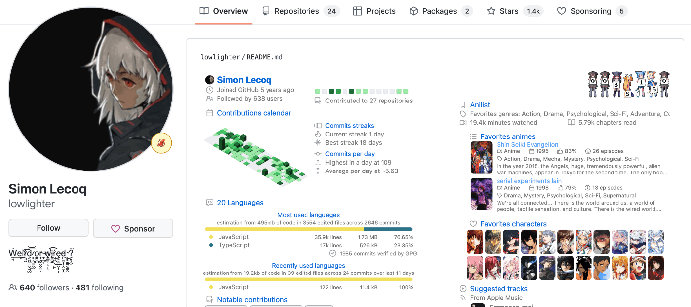
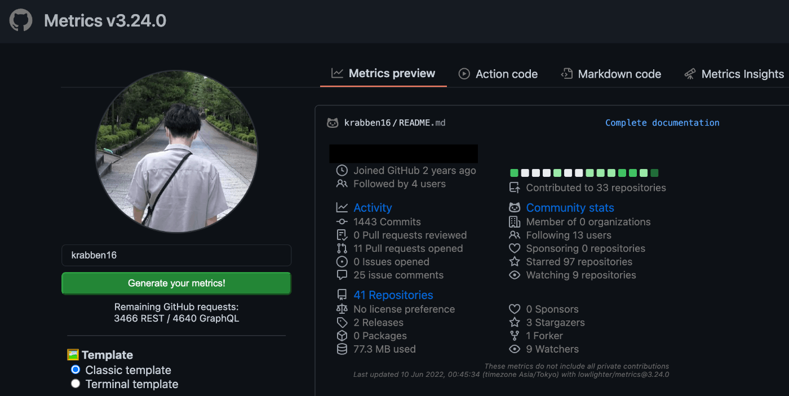
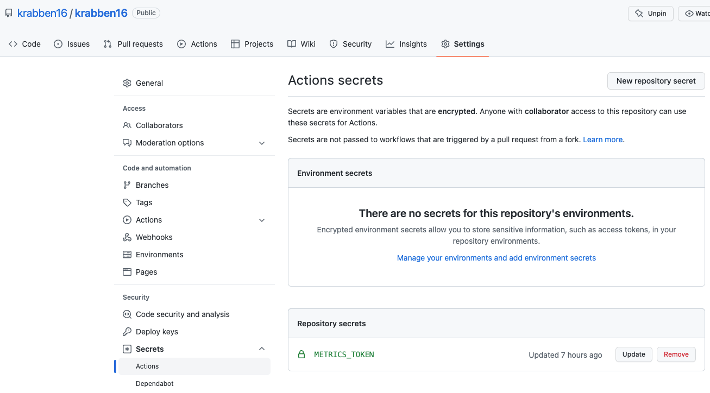
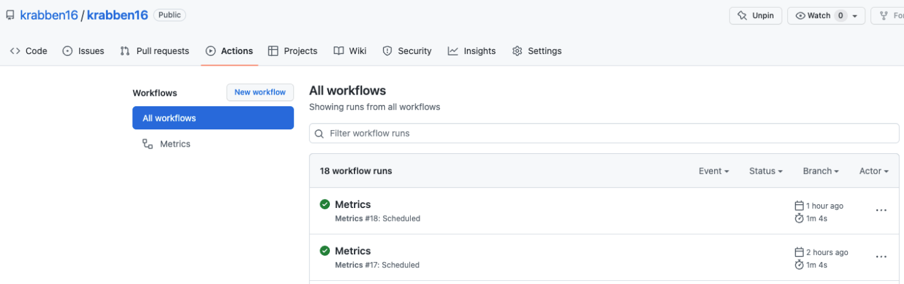
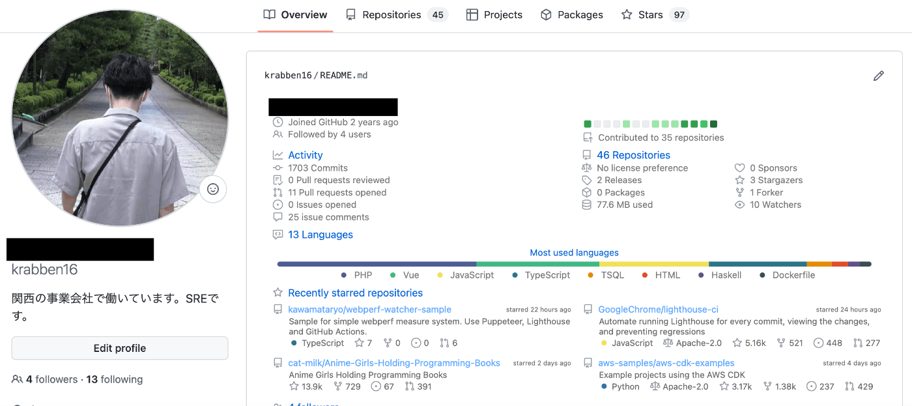

## はじめに

GitHub アカウントの Overview に表示されるやつです。



こちらのインフォグラフィックジェネレーターを使用します。GitHub アカウントの統計情報を SVG、Markdown、PDF、JSON などの形で出力できます。

参考: https://github.com/lowlighter/metrics

セットアップの方法はいくつかありますが、今回は[GitHub Actions を使う方法](https://github.com/lowlighter/metrics/blob/master/.github/readme/partials/documentation/setup/action.md)を試してみます。

## リポジトリの作成

アカウント名と同じ public リポジトリを作成します。
自分の環境だと [cuavv/cuavv](https://github.com/cuavv/cuavv) というリポジトリになります。

参考: https://docs.github.com/ja/account-and-profile/setting-up-and-managing-your-github-profile/customizing-your-profile/managing-your-profile-readme

## Action code の生成

以下のサイトで統計情報をどのように表示するかシミュレートできます。

参考: https://metrics.lecoq.io/



また、Action code タブに統計情報を画像の形で出力する GitHub Actions のコードが生成されます。

```yaml
# Visit https://github.com/lowlighter/metrics/blob/master/action.yml for full reference
name: Metrics
on:
  # Schedule updates (each hour)
  schedule: [{ cron: '0 * * * *' }]
  # Lines below let you run workflow manually and on each commit
  workflow_dispatch:
  push: { branches: ['master', 'main'] }
jobs:
  github-metrics:
    runs-on: ubuntu-latest
    permissions:
      contents: write
    steps:
      - uses: lowlighter/metrics@latest
        with:
          # Your GitHub token
          # The following scopes are required:
          #  - public_access (default scope)
          # The following additional scopes may be required:
          #  - read:org      (for organization related metrics)
          #  - read:user     (for user related data)
          #  - read:packages (for some packages related data)
          #  - repo          (optional, if you want to include private repositories)
          token: ${{ secrets.METRICS_TOKEN }}

          # Options
          user: cuavv
          template: classic
          base: header, activity, community, repositories, metadata
          config_timezone: Asia/Tokyo
```

:::note
出力フォーマットを指定するオプション`config_output`を設定しなかった場合のデフォルト値は`auto`です。auto はテンプレートで指定した出力フォーマットに従います。ソースの該当箇所を見つけられませんでしたが、おそらく classic テンプレートの出力フォーマットで SVG を指定しているのだと思います。
:::

参考: https://github.com/lowlighter/metrics/blob/master/source/plugins/core/README.md#config_output

## GitHub Actions の設定

Action code をリポジトリの以下の場所に保存します。

参考: https://github.com/cuavv/cuavv/blob/master/.github/workflows/metrics.yml

コード内で`secrets.METRICS_TOKEN`を参照しています。これはジェネレーターが GitHub アカウントの統計情報にアクセスするために必要なものです。Personal Access Token を生成して、その値をリポジトリの secrets に設定します。

### Personal Access Token の生成

Action code 内に記載されている通り、Select scopes で以下のアクセスを許可します。

- read:org
- read:user
- read:packages
- repo

参考: https://github.com/settings/tokens

### secrets の設定

secrets は暗号化された環境変数のことです。生成した Personal Access Token を`METRICS_TOKEN`という名前で登録します。設定場所はリポジトリの Settings > Security > Secrets > Actions です。



### ワークフローの動作確認

設定が問題なければ GitHub Actions が正常に動作してリポジトリに`github-metrics.svg`というファイルがコミットされています。画像を出力するワークフローは yaml の`schedule`で設定した通り 1 時間に 1 回実行されます。



## README.md の作成

出力した画像を読み込むマークダウンファイルを作成します。

参考: https://github.com/cuavv/cuavv/blob/master/README.md

## 画像の表示確認

GitHub アカウントの Overview を表示した時に画像が表示されていれば完成です！



## おわりに

お気に入りは Most used languages です。その他にも統計情報を視覚的に表示するプラグインがいろいろ用意されているので、プロフィールの見せ方のバリエーションが広がりますね 🧐

プラグインの一覧

参考: https://github.com/lowlighter/metrics/blob/master/README.md#-plugins
