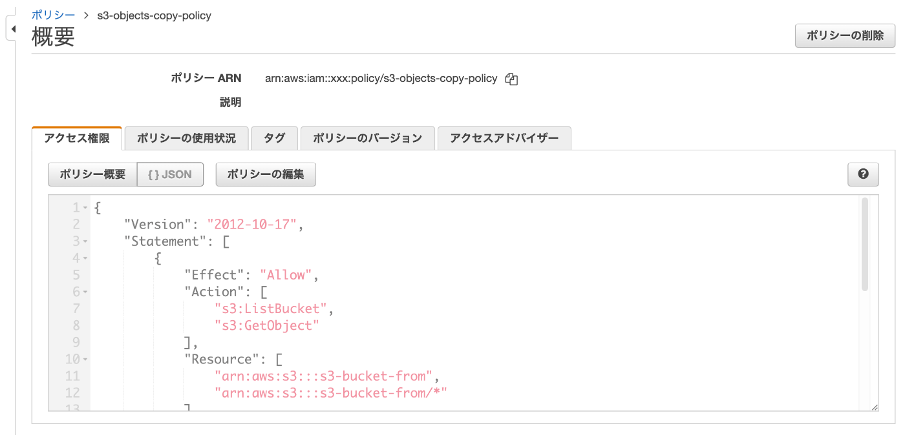
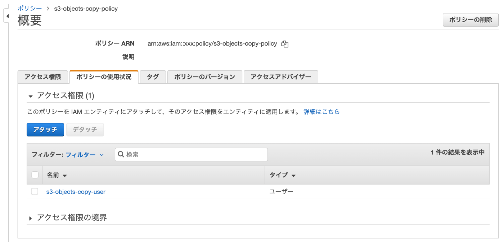

## 何したん

AWSのアカウントAに存在するS3オブジェクトをアカウントBにコピーする作業が発生しました。オブジェクトのコピーはAWS CLIの `aws s3 sync` を実行しましたが、その前にいろいろ対応が必要な作業がありましたので共有します。

## 実行環境

- aws-cli@2.4.18

## 対応方法

以下、A=AWSアカウントA、B=AWSアカウントB

### Aコピー作業用のIAMユーザーを作成

ユーザーの作成はAWSコンソール/AWS CLIなどよしなに対応してください。（例. `s3-objects-copy-user`）
次にポリシーを作成します。コピー元バケットのオブジェクトを一覧表示したり、コピー先のバケットにオブジェクトをコピーしたりするのに必要なアクセス許可を設定します。（例. `s3-objects-copy-policy`）
最後に作成したポリシーをIAMユーザーにアタッチします。

s3-objects-copy-policy

```json
{
  "Version": "2012-10-17",
  "Statement": [
    {
      "Effect": "Allow",
      "Action": ["s3:ListBucket", "s3:GetObject"],
      "Resource": [
        "arn:aws:s3:::<コピー元のバケット名>",
        "arn:aws:s3:::<コピー元のバケット名>/*"
      ]
    },
    {
      "Effect": "Allow",
      "Action": ["s3:ListBucket", "s3:PutObject", "s3:PutObjectAcl"],
      "Resource": [
        "arn:aws:s3:::<コピー先のバケット名>",
        "arn:aws:s3:::<コピー先のバケット名>/*"
      ]
    }
  ]
}
```





### Bバックアップ用のS3バケットを作成

バケットの作成はAWSコンソール/AWS CLIなどよしなに対応してください。（例. `s3-bucket-to`）
次にバックアップ用バケットのバケットポリシーを編集します。AのIAMユーザーがコピー先のバケットにオブジェクトをコピーしたり、オブジェクトを一覧表示したりするのに最低限必要なアクセス許可を設定します。

s3-bucket-toのバケットポリシー

```json
{
  "Version": "2012-10-17",
  "Id": "Policy1611277539797",
  "Statement": [
    {
      "Sid": "Stmt1611277535086",
      "Effect": "Allow",
      "Principal": {
        "AWS": "<Aで作成したIAMユーザーのARN>"
      },
      "Action": "s3:PutObject",
      "Resource": "arn:aws:s3:::<コピー先のバケット名>/*",
      "Condition": {
        "StringEquals": {
          "s3:x-amz-acl": "bucket-owner-full-control"
        }
      }
    },
    {
      "Sid": "Stmt1611277877767",
      "Effect": "Allow",
      "Principal": {
        "AWS": "<Aで作成したIAMユーザーのARN>"
      },
      "Action": "s3:ListBucket",
      "Resource": "arn:aws:s3:::<コピー先のバケット名>"
    }
  ]
}
```

### AWS CLIでコマンドを実行

以下のコマンドを実行すると「コピー元バケットのディレクトリ以下のオブジェクト」が「コピー先バケットのディレクトリ」にコピーされます。コピー完了まで待機しましょう 🛌

```shell
% aws s3 sync s3://<コピー元のバケット名>/<ディレクトリ> s3://<コピー先のバケット名>/<ディレクトリ> --acl bucket-owner-full-control
```

参考: https://aws.amazon.com/jp/premiumsupport/knowledge-center/copy-s3-objects-account/
