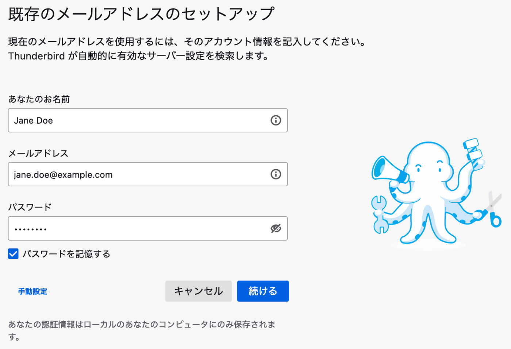
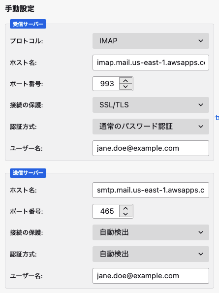
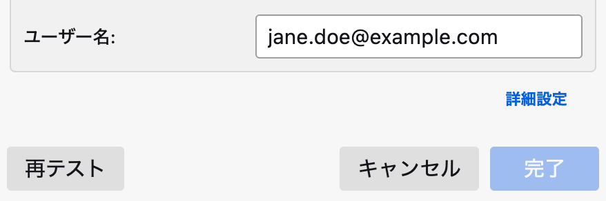
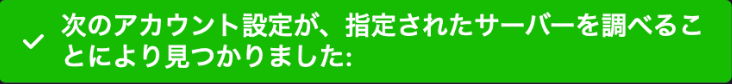

## WorkMailとは？

> Amazon WorkMailはセキュリティに優れた企業向けEメールおよびカレンダーのマネージド型サービスで、デスクトップとモバイルの既存のEメールクライアントアプリケーションに対応しています。Amazon WorkMailによって、ユーザーは選択したクライアントアプリケーションを使って自分のEメール、連絡先、およびカレンダーにシームレスにアクセスできるようになります。

参考: https://aws.amazon.com/jp/workmail/

ドメイン登録やアカウント作成などのセットアップ方法はこちらの記事で解説されているので省略します🙏

参考: https://zenn.dev/bun913/articles/work-mail-practice

## Thunderbirdの設定

まず `既存のメールアドレスのセットアップ` 画面を表示します。WorkMailで作成したアカウントのメールアドレス、パスワードを入力します。タコがおもろいですね（ハサミ使える…？🐙）

次に手動設定をクリックします。受信サーバーにAWSのIMAPサーバー、送信サーバーにAWSのSMTPサーバーを設定します。`ホスト名` はWorkMailでアカウントを作成したリージョンを指定します。（例. us-east-1）
`ユーザー名` は（ややこしいですが）WorkMailで作成したアカウントのメールアドレスを入力します。

**受信サーバー**

| 項目       | 値                                                                |
| ---------- | ----------------------------------------------------------------- |
| プロトコル | IMAP                                                              |
| ホスト名   | imap.mail.<WorkMailでアカウントを作成したリージョン>.awsapps.com |
| ポート番号 | 993                                                               |
| 接続の保護 | SSL/TLS                                                           |
| 認証方式   | 通常のパスワード認証                                              |
| ユーザー名 | <WorkMailで作成したアカウントのメールアドレス>                   |

**送信サーバー**

| 項目       | 値                                                                |
| ---------- | ----------------------------------------------------------------- |
| ホスト名   | smtp.mail.<WorkMailでアカウントを作成したリージョン>.awsapps.com |
| ポート番号 | 465                                                               |
| 接続の保護 | 自動検出                                                          |
| 認証方式   | 自動検出                                                          |
| ユーザー名 | <WorkMailで作成したアカウントのメールアドレス>                   |

### 接続確認

画面下部の `再テスト` ボタンをクリックします。

設定が問題なければ以下のような成功メッセージが表示されるので `完了` ボタンをクリックして終了です。

## おわりに

受信/送信サーバーの接続情報が分からなくて時間を浪費しました。ドキュメントにしっかり書いてありました🤷

参考: https://docs.aws.amazon.com/ja_jp/workmail/latest/userguide/using_IMAP.html
