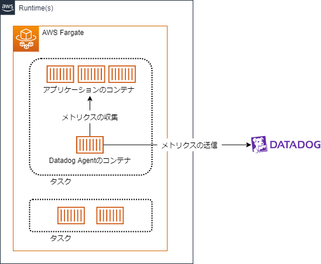
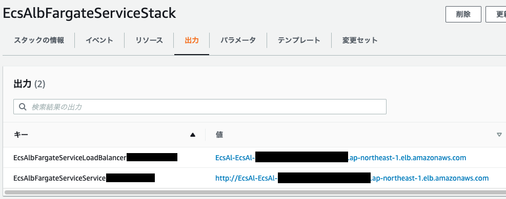

## やること

- Datadog AgentコンテナをECSのタスクに追加し、同じタスクで起動している他のコンテナのメトリクスを収集してDatadogに送信します。
- 上記の構成をCDK(TypeScript)で実装します。



<p class="text-center text-gray-500 italic">メトリクス収集のイメージ図</p>

画像引用元: https://eponas.gitlab.io/epona/guide/how_to/aws/send_ecs_fargate_metrics_to_datadog/

## 実行環境

- yarn@1.22.19
- npm packages
  - aws-cdk@2.28.0
  - typescript@4.7.4
  - aws-cdk-lib@2.28.0

## 事前準備

サンプルコードではSecrets Managerから取得したAPIキーをDatadog Agentが参照します。なのであらかじめSecrets Managerで値にDatadogのAPIキーを設定したシークレットを作成します。シークレットの名前は `EcsAlbFargateServiceDDApiKey` としました。

## 実装

サンプルコードはGitHubに配置しました。

```ts title="index.ts"
import ec2 = require('aws-cdk-lib/aws-ec2')
import ecs = require('aws-cdk-lib/aws-ecs')
import logs = require('aws-cdk-lib/aws-logs')
import secretsmanager = require('aws-cdk-lib/aws-secretsmanager')
import ecsPatterns = require('aws-cdk-lib/aws-ecs-patterns')
import cdk = require('aws-cdk-lib')
import 'dotenv/config'

const app = new cdk.App()
const stack = new cdk.Stack(app, 'EcsAlbFargateServiceStack')

// VPCを作成（同時にパブリック/プライベートサブネットやインターネットゲートウェイ、NATゲートウェイなどが作成される）
// https://docs.aws.amazon.com/cdk/api/v2/docs/aws-cdk-lib.aws_ec2.Vpc.html#initializer
const vpc = new ec2.Vpc(stack, 'ecs-alb-fargate-service-vpc', {
  cidr: process.env.CDK_VPC_CIDR,
})

// Fargateのタスク定義を作成
const taskDef = new ecs.FargateTaskDefinition(stack, 'TaskDef', {
  cpu: 256,
  memoryLimitMiB: 512,
})

// Cloudwatchに作成するロググループの設定
const webLogGroup = new logs.LogGroup(stack, 'WebLogGroup', {
  logGroupName: '/aws/cdk/ecs-alb-fargate-service/web',
  retention: logs.RetentionDays.SIX_MONTHS,
  removalPolicy: cdk.RemovalPolicy.DESTROY,
})
const datadogLogGroup = new logs.LogGroup(stack, 'DatadogLogGroup', {
  logGroupName: '/aws/cdk/ecs-alb-fargate-service/datadog',
  retention: logs.RetentionDays.SIX_MONTHS,
  removalPolicy: cdk.RemovalPolicy.DESTROY,
})

// アプリケーションが動作している想定のWebコンテナをタスク定義に追加
const web = taskDef.addContainer('Web', {
  image: ecs.ContainerImage.fromRegistry('httpd:2.4'),
  containerName: 'web',
  logging: new ecs.AwsLogDriver({
    streamPrefix: 'web',
    logGroup: webLogGroup,
  }),
})

web.addPortMappings({
  containerPort: 80,
  hostPort: 80,
  protocol: ecs.Protocol.TCP,
})

// Datadog APIキーをSecrets Managerから取得
const ddApiKey = ecs.Secret.fromSecretsManager(
  secretsmanager.Secret.fromSecretNameV2(
    stack,
    'DatadogApiKey',
    'EcsAlbFargateServiceDDApiKey'
  )
)

// Datadog Agentが動作するコンテナをタスク定義に追加
taskDef.addContainer('Datadog', {
  image: ecs.ContainerImage.fromRegistry('public.ecr.aws/datadog/agent:latest'),
  memoryLimitMiB: 256,
  containerName: 'datadog',
  logging: ecs.LogDriver.awsLogs({
    streamPrefix: 'datadog',
    logGroup: datadogLogGroup,
  }),
  environment: {
    // メトリクスの収集を有効にする
    // https://docs.datadoghq.com/ja/integrations/ecs_fargate/
    ECS_FARGATE: 'true',
  },
  secrets: {
    DD_API_KEY: ddApiKey,
  },
})

// ECSクラスターを作成
// https://docs.aws.amazon.com/cdk/api/v2/docs/aws-cdk-lib.aws_ecs.Cluster.html
const cluster = new ecs.Cluster(stack, 'Cluster', {
  vpc,
  containerInsights: true, // trueの場合、CloudWatch Container Insightsがクラスターに対して有効になる
})

// ALBが前面にあるECSクラスターで実行されるFargateサービスを構築
// https://docs.aws.amazon.com/cdk/api/v2/docs/aws-cdk-lib.aws_ecs_patterns.ApplicationLoadBalancedFargateService.html
new ecsPatterns.ApplicationLoadBalancedFargateService(
  stack,
  'EcsAlbFargateService',
  {
    cluster, // サービスをホストするクラスター
    desiredCount: 1, // サービス上で実行し続けるタスク定義のインスタンス数の希望値
    taskDefinition: taskDef, // サービス内のタスクに使用するタスク定義
    taskSubnets: {
      // サービスに関連付けるサブネット
      subnets: vpc.privateSubnets,
    },
    openListener: true, // ロードバランサーのリスナーのSecurity Groupをデフォルトで全トラフィックに開放するかどうか
    circuitBreaker: {
      // 配備用サーキットブレーカーを有効にするかどうか
      rollback: true,
    },
  }
)

app.synth()
```

参考: https://chariosan.com/2022/02/25/cdk_ecs_add_datadogagent_container/

## 実行確認

### CloudFormation

EcsAlbFargateServiceStackというスタックが作成されています。「出力」タブでALBのDNS名が出力されています。



アクセスするとWebコンテナで動作するApacheの初期表示と思われる画面が表示されます。


参考: https://ponsuke-tarou.hatenablog.com/entry/2018/12/19/233918

### Datadog

Datadog > Infrastructure > Containersを表示します。ここでWebコンテナ、Datadogコンテナのメトリクスを確認できます🎉


