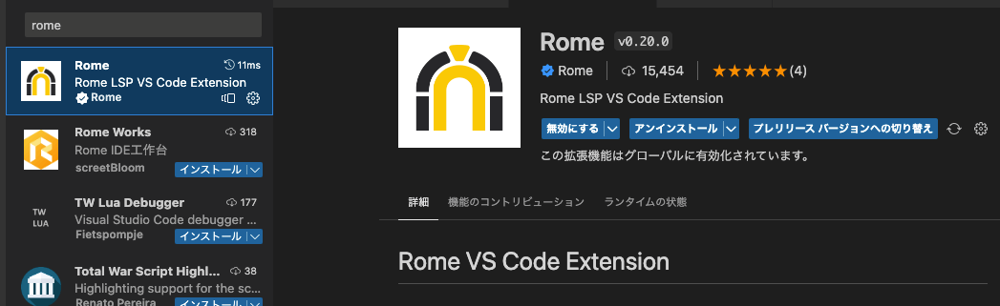
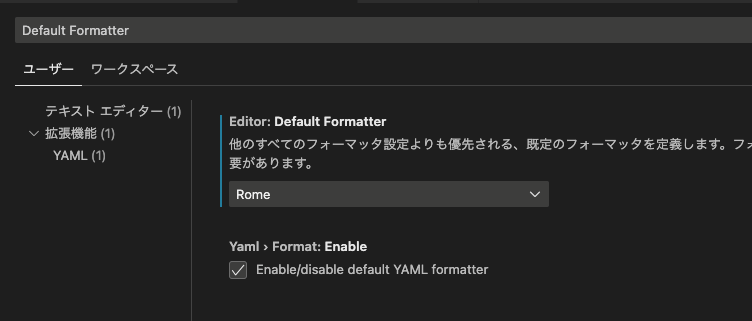
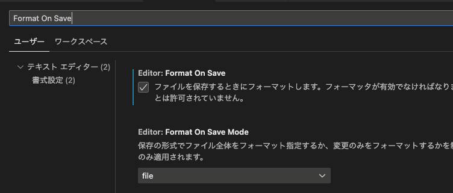

## 前置き

TypeScriptで書いたCDKコードのフォーマッターを選定中です。
ESLintとPrettierはセットアップが面倒に感じるのでRomeを使ってみます。

参考: https://rome.tools/

## 環境

- VSCode 1.75.1
- Rome 0.20.0

## セットアップ

### Rome の設定ファイルを作成

プロジェクトルートにrome.jsonを作成する。リンターとフォーマッターの設定が1ファイルで対応できます。

```json
{
  "linter": {
    "enabled": true,
    "rules": {
      "recommended": true
    }
  },
  "formatter": {
    "enabled": true,
    "formatWithErrors": false,
    "indentStyle": "space",
    "indentSize": 2,
    "lineWidth": 120,
    "ignore": []
  }
}
```

:::note
linterのrecommendedで設定されるルールは以下のページで確認できます。

参考: https://docs.rome.tools/lint/rules/
:::

参考: https://docs.rome.tools/configuration/

### エディタの拡張機能に Rome を追加

拡張機能はVSCodeのみ対応しています。（2023/02/17現在）



参考: https://docs.rome.tools/guides/getting-started/#editor-setup

### VSCode の設定を変更

1. `cmd+,` で設定を開く
1. Default FormatterにRomeを設定する
1. Format On Saveを有効にする





コードを修正して保存するタイミングで整形が実行されます。

## 感想

- Romeのエディタ拡張機能はVSCodeのみ対応しているので、他のエディタを使っている方は設定できません。ESLintやPrettierなど別のフォーマッターのエディタ拡張機能を使う、Romeのnpmパッケージをインストールしてhuskyやlint-stagedと組み合わせてフォーマットを実行する、などの方法を検討した方がいいかもしれません。
- Romeの主要なコントリビュータが開発から離脱したそうで将来性が少し不安です 😓

参考: https://zenn.dev/kyrice2525/articles/article_tech_009
